<br>

Organizations are rapidly moving their IT infrastructure on public clouds and using their native services. AWS cloud remains to be the mostly widely used public cloud service. Development and IT teams are adopting cloud services and deploying their infrastructure to scale up their operations. Cloud security is another aspect where the security team of an organization should work together with the development and operation teams. Cloud security refers to a broad set of policies, controls, procedures, and technologies that work together to protect cloud-based systems, data, and infrastructure.

### Motivation

Cloud security is a popular topic in the industry as organizations migrate their IT from on-premise to cloud environment. Security professionals also need to upskill their knowledge as per industry requirements and enhance their overall knowledge and understanding of cloud security. When I started learning cloud security and practicing practical hands-on skills, I struggled initially to find tutorials on cloud security. I will try to cover all concepts and hands-on step by step tutorial through a series of posts. We will start with setting up the environment and perform an AWS configuration security review. Also, we will explore multiple AWS security misconfigurations that expose sensitive information or take control of hosted applications.

In this post, we will talk about AWS “Shared Responsibility Model” and then set up an AWS Free tier account. We will also set up AWS CLI to perform some actions from commands in your terminal. This blog post is for beginners and for those who never used AWS services.

### Shared Responsibility Model

Before starting the tutorial it is important to understand the shared responsibility model in cloud computing. Amazon Web Services (AWS) has developed a shared responsibility model to regulate the security and compliance of its end-users. Your cloud provider is responsible for making sure your infrastructure built within its platform is secure and reliable. On the other hand, customizable cloud capabilities like application management, network configuration, and encryption are the responsibilities of end-users. 

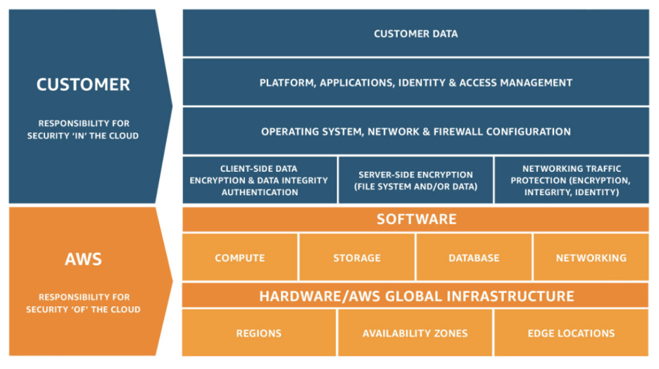

According to the [Gartner report](https://www.gartner.com/smarterwithgartner/is-the-cloud-secure/), it is expected that over the next upcoming years, at least 95% of cloud security failures will be the customer’s fault, and due to misconfiguration of implementation. So it is essential to review cloud configuration and implementation of cloud-native services periodically to protect assets on the public cloud.


### Setup AWS Account 

In order to start with, we need an AWS account and set up users with appropriate permissions. You can sign up for an [AWS Free Tier](https://aws.amazon.com/free/) account and get access to the AWS cloud.

Follow the steps given below to Sign Up AWS Free Tier account:

- Go to  AWS Free Tier https://aws.amazon.com/free/ and click on create a free account.
- Provide your details and signup with an AWS free tier account.


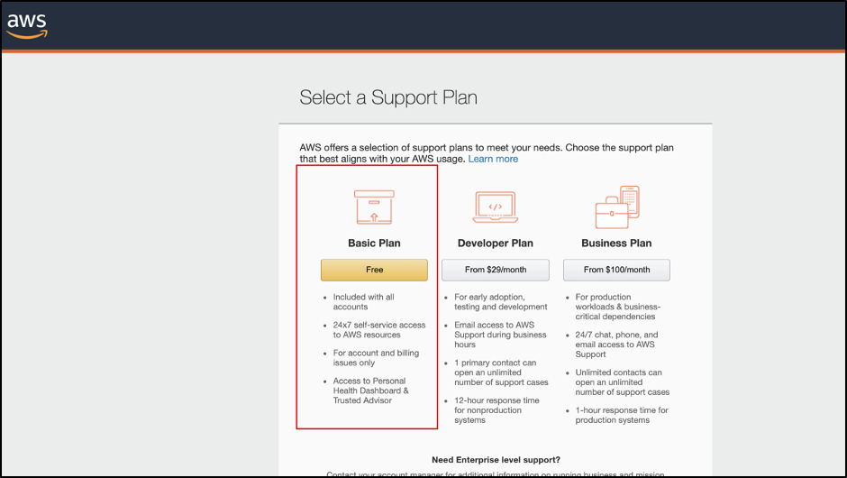


### Setting Up Identity And Access Management

Once you have signed up you need to configure your AWS account and make sure security best practices are implemented in your IAM after signing up with the AWS account. 

Go to Services > IAM to configure your account.


As you can see in your account, most of the security status flags are showing warnings and you need to configure all of them by following instructions.


### Activate Multi-Factor Authentication (MFA)

Activate your multi-factor authentication (MFA) using any Virtual MFA device. In my case, I am using an Authy app to configure multi-factor authentication.

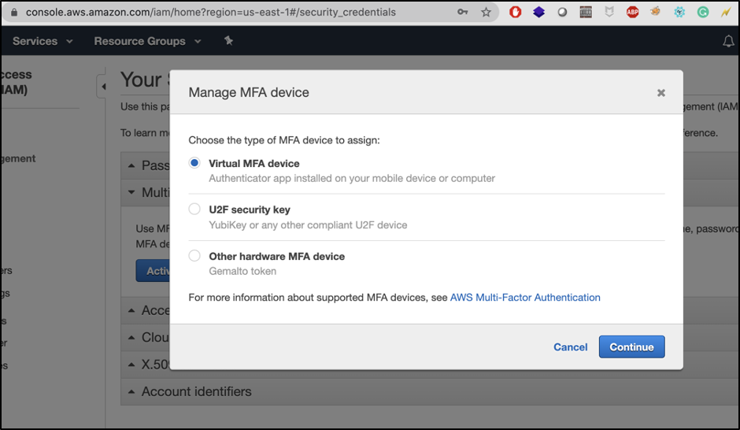

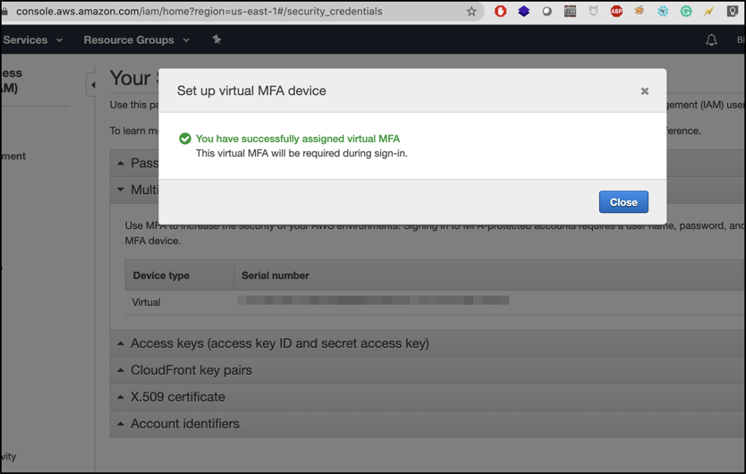


### Create Individual IAM Users

Create two user accounts one is an Admin and another Audit user to access your AWS account through programmatically and console. Do not use your AWS root account for day-to-day interaction with AWS. [Learn More](http://docs.aws.amazon.com/console/iam/security-status-create-users)


Create an admin group and attach it with admin users. You needed to select permission of the admin group as AdministratorAccess.


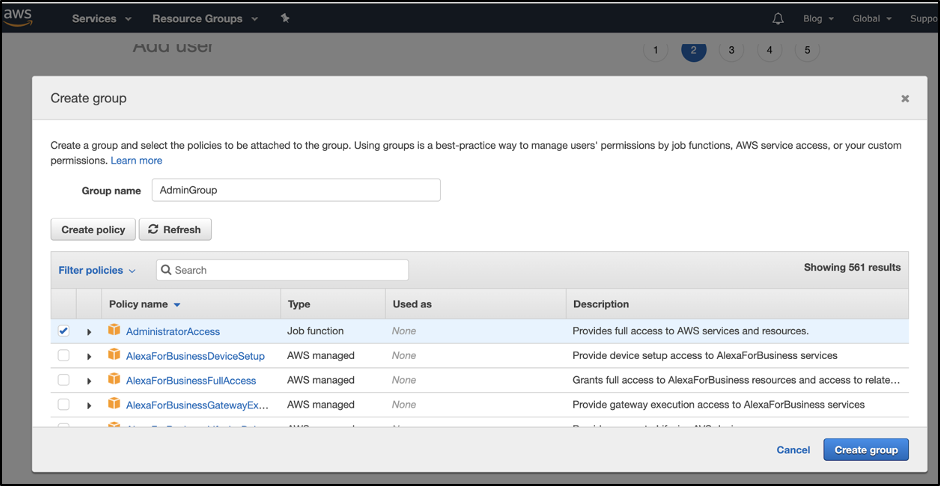

Note and store securely your admin account Access key ID and Secret access key.

Next, create an audit user account similar to how we have created an admin account. We will use an audit user account for our further activities. 


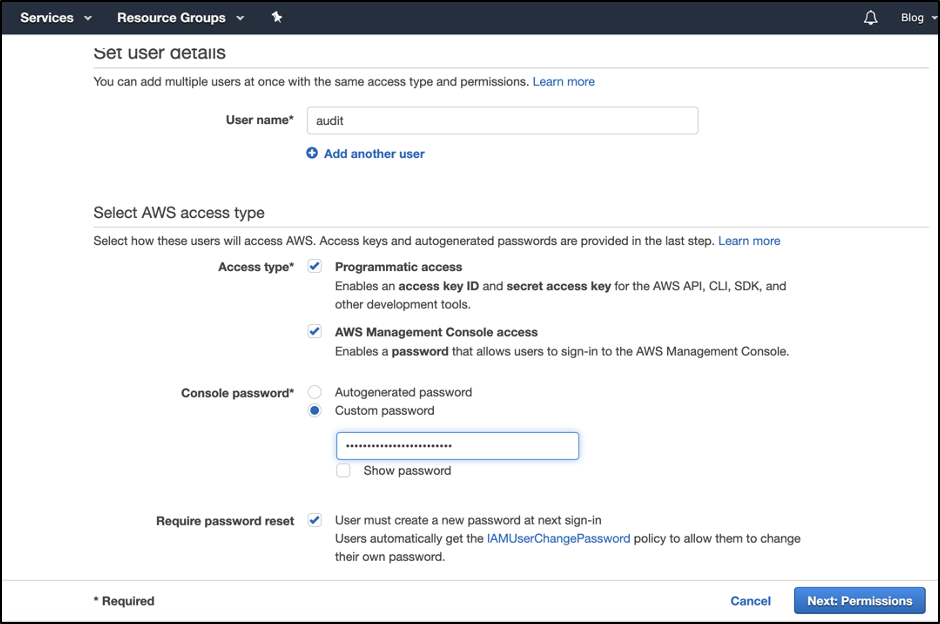

Select “Attach existing policies directly” and attach below policies shown in the below pictures.
- SecurityAudit
- ReadOnlyAccess


### Set Password Policy

Setup you password policy 

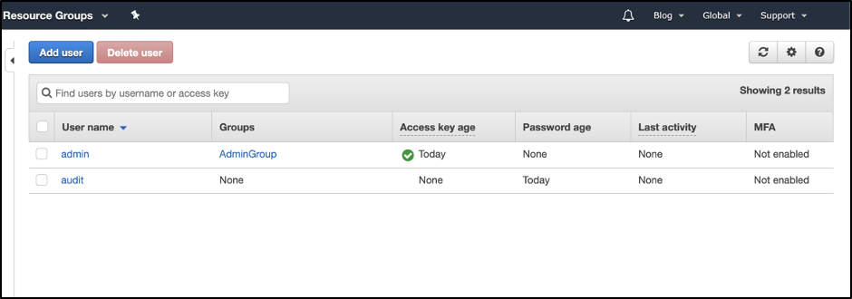


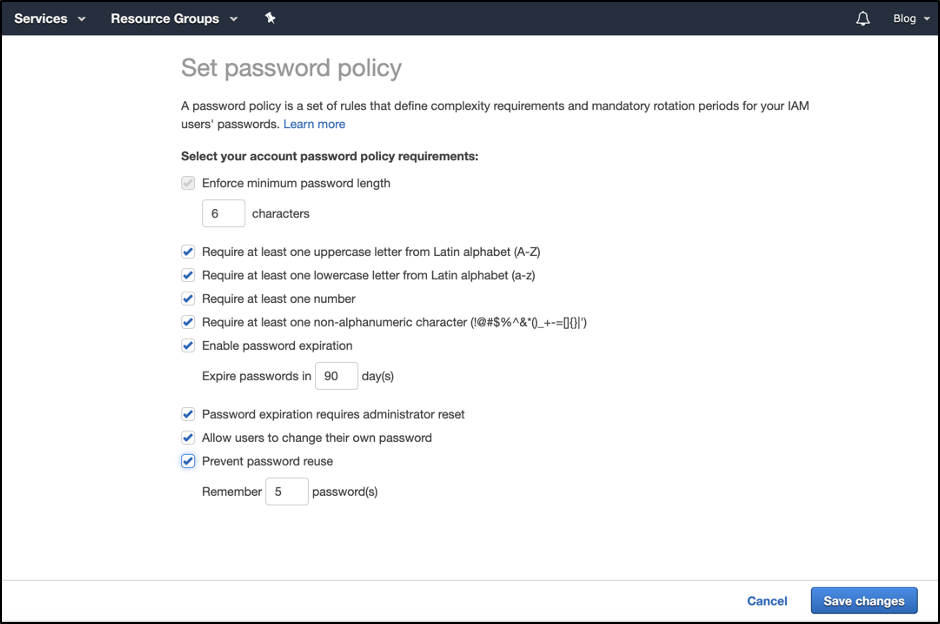


### AWS Command Line Interface

The AWS Command Line Interface (AWS CLI ) is a tool that allows you to interact with AWS services using commands in your command-line shell. It requires minimal configuration and enables you to start running commands that implement functionality equivalent to that provided by the browser-based AWS management console from the command prompt in your terminal.

In order to install AWS CLI, follow the below given instruction in AWS official website:


[Linux](https://docs.aws.amazon.com/cli/latest/userguide/install-cliv2-linux.html) 
[MacOS](https://docs.aws.amazon.com/cli/latest/userguide/install-cliv2-mac.html)
[Windows](https://docs.aws.amazon.com/cli/latest/userguide/install-cliv2-windows.html)


### AWS CLI Configuration

AWS CLI configuration required AWS Access key ID, AWS Secret access key, and AWS Region.  

This information was found while creating users that you noted. We’ll be using the audit user’s access key and secret key. 

Type the below command to configure AWS keys and provide your AWS Access Key ID, AWS Secret Access key and region you preferred :

```bash
aws configure
```


CLI credentials file – The credentials and config file are updated when you run the command aws configure. The credentials file is located at `~/.aws/credentials` on Linux or macOS, or at `C:\Users\USERNAME\.aws\credentials` on Windows. This file can contain the credential details for the default profile and any named profiles.

### Getting Started With AWS CLI

To start with AWS CLI it is very important to have [AWS CLI Command Reference](https://docs.aws.amazon.com/cli/latest/index.html) which provides a consistent interface for interacting with all parts of AWS. 

We are going to widely use the AWS CLI Command reference that helps us explore all parts of AWS services. Using AWS CLI you can perform all actions in your AWS account such as create a user, group, policy even you can delete, modify, and update users through IAM.

Let's explore some of the IAM functionality using AWS CLI by running some commands.

We are going to widely use the AWS CLI Command reference that helps us explore all parts of AWS services. Using AWS CLI you can perform all actions in your AWS account such as create a user, group, policy even you can delete, modify, and update users through IAM.

Let's explore some of the IAM functionality using AWS CLI by running some commands.

### Create A New User


```bash
aws iam create-user --user-name Bob
```

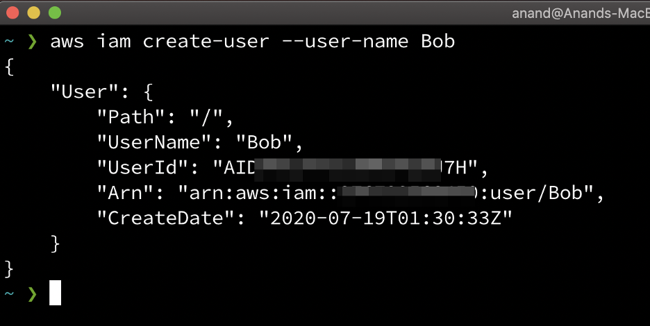

As you can see below, the picture from the AWS console, user was created successfully.

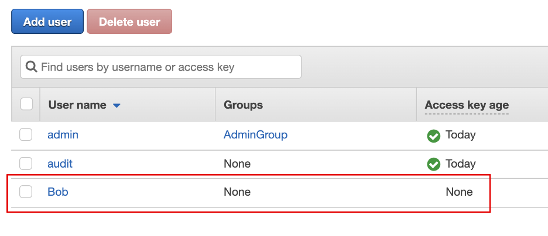

### Create Access Key

Now let’s create user’s access key by using the following command

```bash
aws iam create-access-key --user-name Bob
```

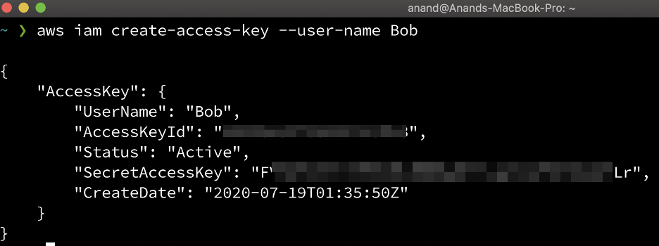

As you can see we have successfully created a user’s access key by using the AWS CLI command.

But our new user Bob does not have permission or not added to any group. So, our next task is to add Bob users to the admin group. 

Let’s suppose you don't know how many groups into an AWS account. You can get the list by below command and add any user to the group.

```bash
aws iam list-groups
```


Let’s add Bob user into AdminGroup by typing below command.

```bash
aws iam add-user-to-group --user-name Bob --group-name AdminGroup
```

As you can see in the picture below after running the above command Bob user added into AdminGroup and get access to all admin permission.

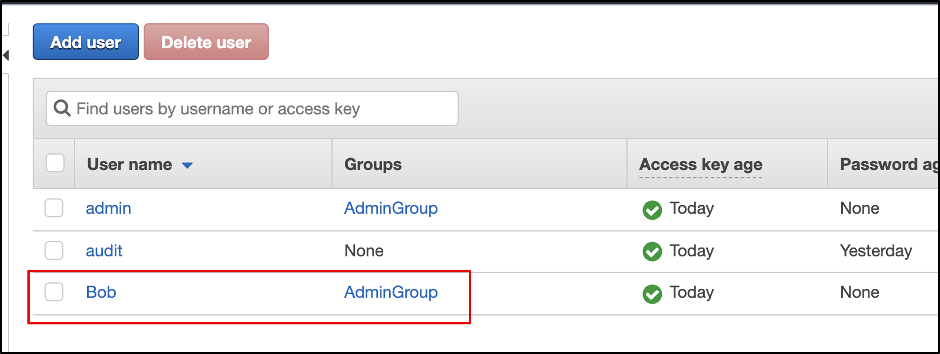


Now let’s delete Bob user from our AWS account by following the below command. 

We Cannot delete the entity and must be removed from the group first and remove the access key from the user. 

```bash
aws iam remove-user-from-group --user-name Bob --group-name AdminGroup
```

```bash
aws iam delete-access-key --access-key-id AKIDPMS9RO4H3FEXAMPLE --user-name Bob
```

```bash
aws iam delete-user --user-name Bob
```

These are just examples to show how AWS CLI works and we can access functionalities by running commands. In a similar manner, you can perform multiple actions from the command line which we will explore in future tutorial blog posts. 


### Conclusion

In this blog post, we’ve learned  about AWS Shared Responsibility Model, then created an AWS account and set up AWS CLI to get comfortable with command-line functionality. In our next blog posts, we’ll explore more about AWS security configuration and implementation.

### ***About Author***

***[Anand Tiwari](https://twitter.com/anandtiwarics) is a Senior Security Consultant at NotSoSecure with expertise in Web Application Security, Cloud Security and DevSecOps. He is also the author of an Open Source tool called [ArcherySec](https://archerysec.com)***.

### References:

[https://aws.amazon.com/compliance/shared-responsibility-model/](https://aws.amazon.com/compliance/shared-responsibility-model/)

[https://docs.aws.amazon.com/cli/latest/index.html](https://docs.aws.amazon.com/cli/latest/index.html )

[https://docs.aws.amazon.com/cli/latest/userguide/install-cliv2-mac.html](https://docs.aws.amazon.com/cli/latest/userguide/install-cliv2-mac.html)

[https://aws.amazon.com/free/](https://aws.amazon.com/free/)


